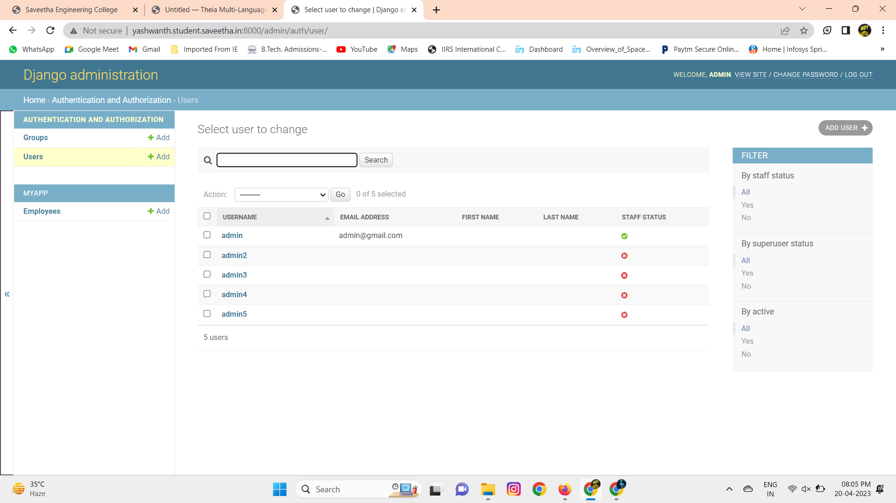
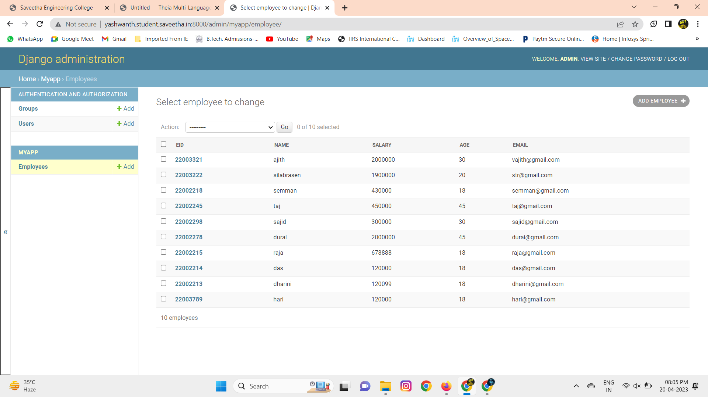

# Ex02 Django ORM Web Application

## AIM
To develop a Django application to store and retrieve data from a student database using Object Relational Mapping(ORM).

## Entity Relationship Diagram

## DESIGN STEPS

### STEP 1:
clone the respoitory to thiea idel. Start a new app inside the project folder

### STEP 2:
Type the appropricate code for your table and provide appropriate data types to the columns

### STEP 3:
create a report about your project in readme.in file and upload the django.orm.app folder to your remote respository 

## PROGRAM

'''
admin.py
from django.contrib import admin
from .models import Employee,EmployeeAdmin
admin.site.register(Employee,EmployeeAdmin)

models.py
from django.db import models
from django.contrib import admin
class Employee (models.Model):
    eid=models.CharField(max_length=20,help_text='Employee ID')
    name=models.CharField(max_length=100)
    salary=models.IntegerField()
    age=models.IntegerField()
    email=models.EmailField()
    
class EmployeeAdmin(admin.ModelAdmin):
    list_display=('eid','name','salary','age','email')
'''

## OUTPUT

## RESULT
The program for creating an employee database using ORM is executed successfully.
